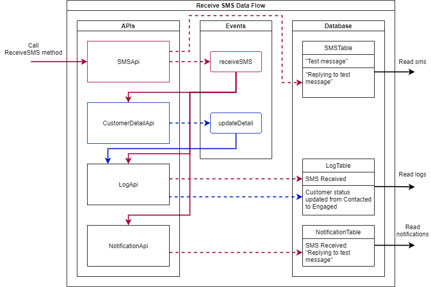

# Designing MVC Using UML

This [Data Flow Diagram](./Receive-SMS-Data-Flow.png) is a sample of the design process for a SMS App project during my co-op work term and was last updated on August 5, 2021.

## Artifact Story

This diagram displays the design of Event Publishing/Consuming used to communicate across separate APIs as microservices for the method that performs Receiving an SMS Message. The purpose of this diagram was to identify and establish the necessary connections between the APIs and each of their respective responsibilities to alter the information in the database. The dotted lines drawn into events imply event publishing; the ones drawn into database tables imply records being added. The solid lines drawn into the tops of the APIs imply event consumption. The red lines show the flow of the receiveSMS event and the blue lines show the flow of the updateDetail event.

In this sample, the SMSApi is called with the ReceiveSMS method to initiate the process. Then the SMSApi adds the message "Replying to test message" to the SMSTable. Meanwhile, it publishes the receiveSMS event. This event is consumed by the other three APIs. Asynchronously, each of the APIs perform their responsibilities:

* CustomerDetailApi consumes the receiveSMS event then performs logic operations to create an appropriate updateDetail event that is then published.
* LogApi consumes both the receiveSMS and updateDetail events. LogApi then adds the appropriate records to the LogTable.
* NotificationApi consumes the receiveSMS event then adds the appropriate record to the NotificationTable.

The records in each of the tables are then able to be read, completing the process.

Discussing the design with the team and drawing it out in this diagram helped us see how each API interacts with one another and made task distribution among our team efficient and comprehensive.

This experience has been extremely helpful in teaching me how to break down the various responsibilities of a process into smaller tasks for separate APIs to manage. I certainly will be making use of data flow diagrams to organize how event publishing and consuming should be structured for future projects.
