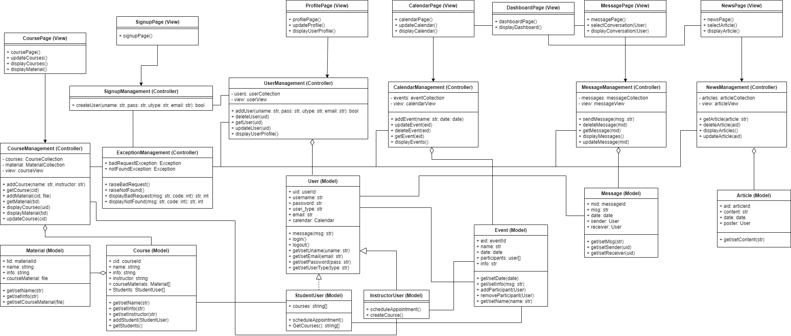

# Designing MVC Using UML

This [UML Diagram](./UML-Software-Architechture-Diagram.png) was designed for the final project of CSCC01: Introduction to Software Engineering and was last updated on November 5, 2020.

## Artifact Story
This diagram was used to design the system architecture of an MVC online learning web application using S.O.L.I.D. design principles.

We divide the system components into front end (Views) and back end (Models) and connect them using RESTful API (Controllers). We keep collections of objects for each element: users, courses, events, and messages. These objects are interactable through their respective controllers which in turn update the respective collection in the database as an observer. This is displayed to and interacted by the application user through the views on pages and modules within the pages (such as calendar and messages on the dashboard page).

We designed using Single Responsibility Principle by breaking down the components into specific functionalities, in [CRC Cards](./CRC.md).

We made use of the Open/Closed Principle (OCP) in the model of a Course. Originally we left open the field for Material as an abstract list of elements within a Course. We later designed the model for Material to extend this to handle the particular file types that a Material might include.

We made use of the Liskov Substitution Principle (LSP) when designing Users by implementing them in two separate classes: StudentUser and InstructorUser (with also the openness to add more user types in accordance with OCP). This helped us consider how we might want to implement subclasses for particular users to accommodate special cases.

Placing down our architecture in this diagram helped us better understand how we can design to minimize module coupling and made implementation of the code much more efficient and cohesive amongst our team.

This experience has enforced in me a higher prioritization in designing software structure before attempting to implement. Looking back, I certainly would have spent more time discussing with my team about these designs to flesh out our ideas more concretely.
